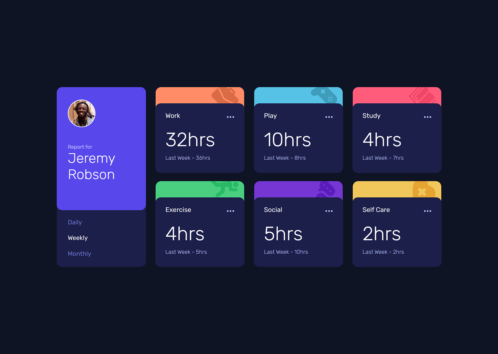
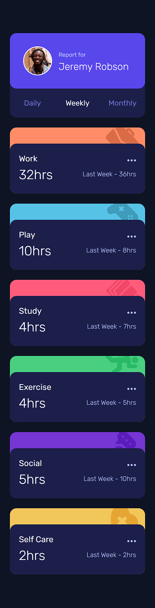

# Frontend Mentor - Time tracking dashboard solution

This is a solution to the [Time tracking dashboard challenge on Frontend Mentor](https://www.frontendmentor.io/challenges/time-tracking-dashboard-UIQ7167Jw).
## Table of contents

- [Overview](#overview)
  - [The challenge](#the-challenge)
  - [Screenshot](#screenshot)
  - [Links](#links)
- [My process](#my-process)
  - [Built with](#built-with)
  - [Continued development](#continued-development)
- [Author](#author)

## Overview

### The challenge

Users should be able to:

- View the optimal layout for the site depending on their device's screen size
- See hover states for all interactive elements on the page
- Switch between viewing Daily, Weekly, and Monthly stats

### Screenshot

### Links

- Solution URL: [Add solution URL here](https://your-solution-url.com)
- [Live Site](https://vigilant-villani-97d20c.netlify.app/)

## My process

It was a fairly simple and straightforward process - used CRA to bootstrap a react application, created the profile card component, focusing on the mobile design first, then moving onto the individual habits a user would track by making a habit card component. Once I was done with the mobile design (375px) I moved onto the desktop design (1440px) and spent time getting that layout right.

### Built with

- Semantic HTML5 markup
- CSS custom properties
- Flexbox
- Mobile-first workflow
- [React](https://reactjs.org/) - JS library

### Continued development

For continued development I would add more functionality, such ass adding and removing things for tracking time, auth (register, login, etc.). For monetization it might be prudent to limit the number of items a free user can have vs a subscribed one.

I would also add more breakpoints besides the one the project requires (375px and 1440px) for better responsiveness.

## Author

- Website - Coming Soon!
- Frontend Mentor - [@TheDilp](https://www.frontendmentor.io/profile/TheDilp)
